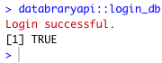

```{r setup, include=FALSE}
knitr::opts_chunk$set(echo = TRUE,
                      fig.align = "center",
                      out.width = "400px")
```

# Purpose

This document demonstrates how researchers can store data on a repository and access
the data using the repository's application program interface (API).

We demonstrate this using R and Databrary, but similar workflows are possible using other scripting tools and other repositories.

# Preparation

## Secure authorization to access Databrary

Databrary requires researchers to secure authorization from their institutions prior to accessing restricted data and materials.
Authorization involves the signature of a Databrary Access Agreement (DAA) by someone from the researcher's institution who has signatory authority.
Details about the authorization process can be found [here](https://databrary.org/about/agreement.html).

To create an account and start the authorizations process, visit <https://databrary.org/register>.

## Download and install the `databraryapi` R package.

1. Install the `devtools` package via `install.packages("devtools")`.
2. Download the `databraryapi` package from GitHub via `devtools::install_github("PLAY-behaviorome/databraryapi")`.
3. Store your login credentials for Databrary in a secure form that R can access by running `databraryapi::config_passwd()`.
4. Test logging in to Databrary via `databraryapi::login_db("your_db_account")`, substituting your Databrary account ID (email) for `your_db_account`. If all is well, you should see the following:

```{r}

```

# Gathering data from Databrary

## Getting summary statistics about Databrary

Users can query Databrary for summary statistics about the system.

```{r}
databraryapi::get_db_stats()
```

## Summarizing demographic data from a shared study

Pamela Cole and colleagues have shared a dataset (called a 'volume') on Databrary. The citation is as follows:

Cole, P.M., Gilmore, R.O., Scherf, K.S., Perez-Edgar, K. & Vigeant, M.C. (2017). Young children's neural processing of their mother’s voice: An fMRI study. Databrary. Retrieved April 5, 2021 from http://doi.org/10.17910/b7.339

If we visit it in a browser, we observe that this is volume 339. The number is important because it is how we will use the API commands to gather data about the study.

First, we list information about the volume by entering the volume number (id) as a parameter to the `databraryapi::list_volume_metadata(vol_id = 339)` function.

```{r}
databraryapi::list_volume_metadata(vol_id = 339)
```

Next, let's download demographic data about the participants in this study.

```{r}
vol_339 <- databraryapi::download_session_csv(vol_id = 339)
```

We can view the structure of the data using the `str()` function. We do not show the output here because this may expose identifiable data about the participant, namely their birthdates.

```
str(vol_8)
```

However, we can generate tables that summarize demographic data for the child (`participant1`) participants and their mothers (`participant2`). We drop row 32 because it contains information about the study as a whole.

```{r}
stats::xtabs(~ participant1.gender + participant1.race, data = vol_339[-32,])
```

```{r}
stats::xtabs(~ participant2.gender + participant2.race, data = vol_339[-32,])
```

So, there were 31 mother/child dyads in the study, with 19 girls and 12 boys.

## Putting it all together

The following commands repeat the above, but in a form that we can use to make a figure for the paper.

```{r}
databraryapi::list_volume_metadata(vol_id = 339)
```

### Children

```{r}
vol_339 <- databraryapi::download_session_csv(vol_id = 339)
vol_339 <- vol_339[-32,] # drop materials folder in row 32
stats::xtabs(~ participant1.gender + participant1.race, data = vol_339)
```

### Mothers

```{r}
stats::xtabs(~ participant2.gender + participant2.race, data = vol_339)
```
